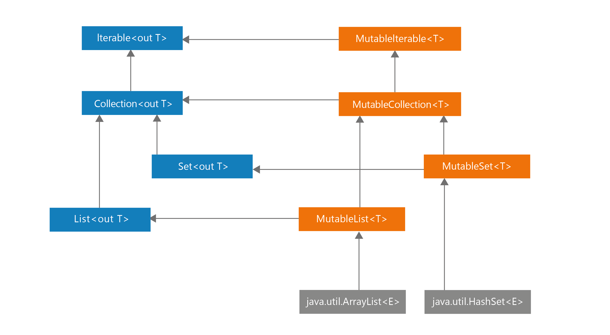

# 第1条：限制可变性

当我们在 Kotlin 模块中设计程序时，每个模块都是由不同的元素组成的，比如类、对象、函数、类型别名和顶层属性。

其中一些元素可以存储状态，例如通过使用 `var`声明一个可读写属性 ，或创建一个 Mutable 的可变对象：

```kotlin
var a = 10
val list: MutableList<Int>
```

当元素持有状态时，它的行为方式不仅取决于你如何使用它，还取决于其历史状态。带有状态的类的典型例子就是一个持有货币余额的银行账户：

```kotlin
class InsufficientFunds : Exception()

class BankAccount {
    var balance = 0.0
        private set

    fun deposit(depositAmount: Double) {
        balance += depositAmount
    }

    @Throws(InsufficientFunds::class)
    fun withdraw(withdrawAmount: Double) {
        if (balance < withdrawAmount) {
            throw InsufficientFunds()
        }
        balance -= withdrawAmount
    }
}

val account = BankAccount()
println(account.balance) // 0.0
account.deposit(100.0)
println(account.balance) // 100.0
account.withdraw(50.0)
println(account.balance) // 50.0
```

这里 `BankAccount` 有一个状态 —— `balance` ，用于表示该账户上的余额。 持有状态是一把双刃剑，一方面它非常有用，我们可以随时改变它，但是另一方面，管理状态是一件困难的事情，因为：

1. 如果一个程序有多个可变状态的地方，那么它是难以理解和调试的。这些突变状态间的关系需要被理解，而且当它们数量变多时，我们很难追踪它们是如何变化的。 具有许多相互依赖的可变状态的类通常很难被理解和修改，可能会导致一些意想不到的错误；
2. 可变值使得我们难以对其进行推断。 不可变的状态，其值永远是清晰可见的。而可变的状态难以推断，因为他可能会在任何时间突变，我们即使在某个时间上检查并确定了它的值，也不意味着它之后都是这个值；
3. 在多线程环境下，程序会适当的进行同步，而每一个状态突变都可能是潜伏的错误；
4. 可变元素难以测试。当我们去测试程序时，可变性越多，那我们要测试的状态就会越多。就例如，我们需要测试的状态的数量通常会随着同一对象或文件中突变点的数量增加而呈指数增长，因为需要测试各个状态的不同的组合；
5. 当状态发生变化时，通常需要通知其他类。比如，当我们将一个可变元素加入到一个排好序的数组，一旦这个元素改变，我们就需要对数组进行重排。

随着项目复杂性增加、突变点变多，我们通常会遇到状态一致性的问题，那些在大型团队中工作的开发人员经常如此。让我们看一个例子，了解管理共享状态有多难。看看下面的代码，这个程序试图在多个线程中去修改同一个属性，但是由于冲突，其中的一些线程的操作将会被丢弃：

```kotlin
var num = 0
for (i in 1..1000) {
    thread {
        Thread.sleep(10)
        num += 1
    }
}
Thread.sleep(5000)
println(num)  // 最终打印的值不是 1000，而且每次运行，打印的值都会不同
```

当我们使用 Kotlin 协程的时候，冲突会少一些，因为涉及的线程会少，但是问题仍然会发生：

```kotlin
suspend fun suspendAdd() {
    var num = 0
    coroutineScope {
        for (i in 1..1000) {
            launch {
                delay(10)
                num += 1
            }
        }
    }
    print(num)  // 每次都是不同的数字，且少于 1000
}
```

在真实的项目中，我们通常是不允许这些操作丢失的，所以我们会使用一些同步的手段，如下面所示代码那样。实现同步是困难的，并且随着突变点变多会变得更难，所以限制元素可变性会有所帮助。

```kotlin
val lock = Any()
var num = 0
for (i in 1..1000) {
    thread {
        Thread.sleep(10)
        synchronized(lock) {
            num += 1
        }
    }
}
Thread.sleep(1000)
print(num)  // 1000
```

可变性的缺点是如此之多，以致于有些语言根本不允许状态发生变化，这些语言都只使用纯函数，一个比较著名的例子就是 Haskell 语言。不过这种语言很少用于主流项目开发，因为不可变性让程序失去了灵活性， 使得编程困难的进行下去。让状态可变是表示现实世界系统状态的一个非常有用的方法。**我推荐使用可变的状态，但是要谨慎地、明智地去决定程序哪里可以使用突变点**。好消息是 Kotlin 可以很好地支持限制可变性。

### Kotlin 限制可变性

Kotlin 被设计成限制可变性的，它能轻易的创建出不可变对象或不可变属性，这是 Kotlin 多个功能和特性所催生出的结晶，这里面最重要的点是：

* **只读属性 `val`**
* **分离可读写集合和只读集合**
* **数据类的 `copy`**

接下来让我们逐一讨论它们吧。

#### 只读属性 `val`

在 Kotlin 中，我们可以将每个属性设置为 `只读val(value)`，或 `可读写var(variable)`，只读属性 `val` 不允许设置值：

```kotlin
val a = 10
a = 20 // Error!
```

但是要注意，_只读属性不一定是不可变的，也不一定是 final 的_。 只读属性可以保存一个可变对象：

```kotlin
val list = mutableListOf(1, 2,3)
list.add(4)

print(list) // [1, 2, 3, 4]
```

一个只读属性同样也可以在 getter 里面依赖其它可读写属性：

```kotlin
var name: String = "Marcin"
var surname: String = "Moskla"
val fullName
    get() = "$name $surname"

fun main() {
    print(fullName) // Marcin Moskala
    name = "Maja"
    print(fullName) // Maja Moskala
}
```

注意这里， `fullName` 发生了变化。一个 val 值的变化是有可能的，这是因为每当我们设置一个自定义 getter 时，每次请求这个值都会重新调用一遍其表达式。

```kotlin
fun calculate(): Int {
    print("Calculating...")
    return 42
}

val fizz = calculate() // Calculating...
val buzz
    get() = calculate()

fun readOnlyProper3() {
    print(fizz) // 42
    print(fizz) // 42
    print(buzz) // Calculating... 42
    print(buzz) // Calculating... 42
}
```

Kotlin 属性默认是封装起来的，它们可以有自定义访问器（getter / setter），这一特性在 Kotlin 中非常重要，因为它在我们更改或定义 API 时提供了灵活性。它将在第16条中详细说明：属性应该代表状态，而不是行为。 但是其核心思想是： `val` 不提供突变特性，它只是一个 getter，而 `var` 同时是 getter 和 setter 。这也是为什么可以用 var 来覆盖 val：

```kotlin
interface Element {
    val active: Boolean
}

class ActualElement : Element {
    override var active: Boolean = false
}
```

综上所述，只读属性 val 的值可以修改的，但这样的属性没有直接提供突变点，当我们需要同步或对程序分析时，突变点是问题的主要来源。 这就是为什么我们更喜欢使用 val 而不是 var。

请记住，尽管 val 并不一定代表不可变，它可以由 getter 或者 delegate 定义，这些能让我们更自由的修改它。 但是使用 final 的属性依然是首选的。我们能更容易的对其进行值推断，因为它们在定义时就已经说明了状态。它们在 Koltin 中也得到了更好的支持，例如，可以被智能转化：

```kotlin
var name: String? = "Marton"
val surname: String = "Braun"

val fullName: String?
    get() = name?.let { "$it $surname" }

val fullName2: String? = name?.let { "$it $surname" }

fun main() {
    if (fullName != null) {
        print(fullName.length) // compile error！
    }

    if (fullName2 != null) {
        print(fullName2.length) // 12
    }
}
```

不可能对 `fullName` 进行智能强转，因为它使用了自定义 getter， 所以它可能会在每次检查时给出不同的值（例如其他线程可能会改变 `name` 的值），非局部属性只有它们是 final 且没有自定义 getter 时才能进行强转。

#### 分离可读写集合和只读集合

类似的，由于 Kotlin 分隔了可读写和只读属性，Kotlin 同样的也分隔了可读写和只读集合，这要归功于集合良好的层次结构设计。 看一下 Kotlin 集合层次结构的图表， 在左侧，你可以看到只读的 `Iterable`、 `Collection`、`Set` 和 `List` 接口。这意味着它们没有任何允许修改其元素的方法。 在右侧，你可以看到 `MutableIterable`、`MutableCollection`、`MutableSet` 和 `MutableList`，它们代表可变集合。 请注意，每个可变接口扩展了相应的只读接口，并添加了允许修改的方法。这与属性的工作原理类似，只读属性意味着只是一个 getter，而可读写属性意味着有 getter 和 setter。



只读集合不一定是不可变的，它们通常是可变的，但是由于修改的接口都被隐藏在后面，所以它们不能被显示改变。 比如 `Iterable<T>.map` 和 `Iterable<T>.filter` 两个函数都使用了可变集合 `ArrayList`, 然后转化成只读集合 `List`。 在下面代码中，你可以看到 stdlib标准库 中 `Iterable<T>.map` 的简化实现：

```kotlin
// 这里只读集合发生变化： List<T> -> ArrayList<R> -（隐式转化）-> List<R>
inline fun <T, R> Iterable<T>.map(transformation: (T) -> R): List<R> {
    val list = ArrayList<R>()
    for (elem in this) {
        list.add(transformation(elem))
    }
    return list
}
```

**返回一个只读接口，而不是在整个过程中使用真正不可变的接口，这种设计选择非常重要**。它给我了们更多的自由，在底层，只要满足这些接口要求，就可以返回任何实际的集合。因此，我们可以使用特定于平台的集合。

这种方法的安全性不亚于使用不可变集合所得到的安全性，唯一的风险是开发人员试图 “攻击系统” ，对其向下转化。这种在 Kotlin 中是不允许的。我们应该能够相信，当我们返回一个只读列表时，外面就只用于读取它。这是契约的一部分，在第二部分中我将会介绍更多关于它的内容。

向下转换集合违反了契约：它依赖实现而不是抽象，而且它也是不安全的，可能会导致意料之外的后果，看看下面这段代码：

```kotlin
val list = listOf(1, 2, 3)

// 千万不要这么做
if (list is MutableList) {
    list.add(4)
}
```

此操作的结果和平台有关。 在 JVM 上， `listOf` 返回 `Arrays.ArrayList` 的一个实例，它实现了 `Java List` 的接口。这个 `Java List` 接口具有 `add` 或 `set` 等方法，因此它会转化为 `Kotlin MutableList` 接口。 然而， `Arrays.ArrayList` 并没有实现其中的一些操作，这就是为什么上面代码运行后会提示下面的结果：

> Exception in thread "main" java.lang.UnsupportedOperationException at java.util.AbstractList.add(AbstractList.java:148) at java.util.AbstractList.add(AbstractList.java:108)

我们无法保证一年后的情况会是如何，底层的集合可能会改变。它们可能会被 Kotlin 实现的真正不可变的集合所取代，而根本不实现 MutablList。没有什么是可靠的，这就是为什么在 Kotlin 中永远不应该将只读集合向下转化为可变集合。如果你需要从只读变为可读，那么你应该使用 `List.toMutableList` 函数，它将创建一个你可以修改的数组副本：

```kotlin
val list = listOf(1, 2, 3)
val mutableList = list.toMutableList()
mutableList.add(4)
```

这种方式不会破坏任何约定，而且对我们来说更加安全，因为我们可以放心的认为，当我们将 List 暴露出去时，它不会被外部修改。

#### 数据类的复制

倾向于使用不可变对象的原因有很多——不可变对象不会改变其内部状态，比如 String 或 Int。 除了已经提到的，我们通常喜欢少可变性的原因外，不可变对象也有其自身的优势：

1. 它们更加容易被推断，因为一旦被创建，它们的状态就保持不变；
2. 不变性使程序并行化变得很容易，因为共享对象之间不存在冲突；
3. 对不可变对象的引用可以缓存，因为它们不会改变；
4. 我们不需要在不可变对象上创建防御性副本，当复制不可变对象时，不需要进行深层复制；
5. 不可变对象是构造其他对象的完美素材。既包括可变又包括不可变的，我们可以决定可变发生在哪里，并且对不可变对象进行操作会更加容易；
6. 我们可以添加它们来设置，或使用它们作为映射中的 key，而对于可变对象则不应该这样做。这是因为这些集合在Kotlin/JVM 中都使用了哈希表，当我们修改已经分类到哈希表的元素时，它的分类可能不再正确，我们将无法找到这个元素。这个问题将在第41条：遵循使用 hashCode 规则中详细描述。 在对集合进行排序时，我们也有类似的问题：

```kotlin
val names: Sorted<FullName> = TreeSet()
val person = FullName("AAA", "AAA")
name.add(person)
name.add(FullName("Jordan", "Hansen"))
name.add(FullName("David", "Blanc"))

print(s) // [AAA AAA, David Blanc, Jordan Hansen]

print(person in names) // true

person.name = "ZZZ"
print(names) // [ZZZ AAA, David Blanc, Jordan Hansen]
print(person in names) // false
```

在最后一次检查中， 集合返回了 false，即使 `person` 还在集合中，但是它已经处于错误的位置了，所以找不到它。

正如你所看见的， 可变对象更危险，也更不可测。 另一方面，不可变对象的最大问题是数据有时需要更改。 解决方案是：不可变对象应该提供方法，在一些更改后生成一个新的对象。例如， `Int` 是不可变的，它有许多方法，比如加号或减号，这些方法不会修改它，而是在这个操作之后返回一个新的 `Int`。 `Iterable` 是只读的，像 `map()` 或 `filter()` 这样的集合处理函数不会修改它本身，而是返回一个新的集合。同样的方法也适用于不可变对象。 例如，假设我们有一个不可变类 `User`，我们需要允许更改它的 `name` 。我们可以用一个 `withSurname()` 方法来支持它，它会生成一个 name 属性被更改的副本：

```kotlin
class User(
    val name: String,
    val surName: String
) {
    fun withSurname(surname: String) = User(name, surname)
}
var user = User("Maja", "Markiewicz")
user = user.withSurname("Moskala")
print(user)  // User(name=Maja, surName=Moskala)
```

我们是有可能会写出这样的函数的，但是如果每个属性都需要一个函数来修改，那就很枯燥了。这时\_数据修饰符\_就应运而生。它生成的方法之一是 `copy()`，它创建一个新的实例，其中所有的主构造函数属性默认与前一个相同，也可以指定新值。在第37条：使用数据修饰符去表示一个数据中详细描述了由数据修饰符。下面一个简单的例子来说明它是如何工作的：

```kotlin
data class User(
    val name: String,
    val surname: String
)

fun main() {
    var user = User("Maja", "Markiewicz")
    user = user.copy(surname = "Moskala")
    print(user)  // User(name=Maja, surname=Moskala)
}
```

这是一个让数据模型不可变的优雅通用的解决方案。当然，这种方法比只用可变对象效率要低，但它具有不可变对象的所有的优点，我们应该在默认情况下首选使用它。

### 不同种类的突变点

假设我们需要表示一个可变列表，有两种方式可以做到，要么使用可变集合，要么使用可读写属性 `var` ：

```kotlin
val list1: MutableList<Int> = mutableListOf() 
var list2: List<Int> = listOf()
```

这两个属性都可以修改，但是方式不同：

```kotlin
list1.add(1)
list2 = list2 + 1
```

这两种方式都可以使用加号赋值操作符来简化：

```kotlin
list1 += 1
list2 += 1
```

这两种方法是正确的，它们都有各自优缺点。它们都有一个单一的突变点，但位于不同的地方。

在第一个例子中，具体的列表发生了变化，我们在使用这种列表时，可能会期待它在多线程情况下会被适当的同步，但这样的假设是很危险的，因为它并不能被实际保证得到同步。

在第二个例子中，我们需要自己实现同步，但是总体来看安全性比第一个更好，因为突变点只是一个属性。但是，在缺乏同步的情况下，请记住我们仍然会丢失一些操作：

```kotlin
var list = listOf<Int>()
for (i in 1..1000) {
    thread {
        list += i
    }
}
Thread.sleep(1000)
print(list.size) // 大概率不是 1000, 每一次都是不同的值
```

**使用可变属性的不变列表，而不是可变列表，允许我们在设置自定义 setter 或使用委托时跟踪该属性的变化**。例如，当我们使用可观察的委托对象时，我们可以记录每一个变化：

```kotlin
var names by Delegates.observable(listOf<String>()) { _, old, new ->
    print("Names changed from $old to $new")
}

names += "Fabio"
// Names changed from [] to [Fabio]
names += "Bill"
// Names changed from [Fabio] to [Fabio, Bill]
```

为了使集合可变，我们需要该集合的一个特殊的可观察实现。 对于使用 `var` 的只读集合，我们可以更容易的控制它们如何改变——只有一个 setter 方法而不是多个方法来改变这个对象，我们可以将 setter 方法设为 `private` :

```kotlin
var annoucements = listOf<Int>()
    private set
```

简而言之，使用**可变集合可能是一个稍微快一点的选择，但是使用可变属性修饰的不可变集合，可以让我们对对象如何更改更多的控制**。

请注意，最糟糕的解决方案是使用可变属性去修饰一个可变集合：

```kotlin
// 千万不要这么做
var list3 = mutableListOf<Int>()
```

因为这样做的话，我们就必需要同步这个集合可能发生变化的两种方式（通过属性更改和内部状态更改）。此外，使用加号赋值是不可能改变它的，因为这样会有歧义：


一般规则是：不应该创建不必要的方式来改变状态，每一种改变状态的方式都是一种代价。这种写法需要被理解和维护。而我们更倾向于限制可变性来减少这种状况。

### 不要对外暴露突变点

当我们暴露一个可变对象为公有属性时，这是一个特别危险的情况，看看这个例子：

```kotlin
class UserRepository {
    private val storedUsers: MutableMap<Int, String> = mutableMapOf()

    fun loadAll(): MutableMap<Int, String> {
        return storedUsers
    }
}
```

你可以使用 `loadAll` 来修改 `UserResposity` 的私有状态

```kotlin
val userRepository = UserRepository()

val storedUsers = userRepository.loadAll()
storedUsers[4] = "Kirill"
```

如果这种修改是偶然的，那就尤其危险了。有两种方式可以解决这个问题，第一个是复制返回的可变对象，我们称之为**防御性拷贝**，当我们处理标准对象时，这是一个很有用的技巧，这里由数据修饰符生成的 `copy` 非常有用：

```kotlin
// 这里 MutableUser 代表一个有突变值的类
private val user: MutableUser = MutableUser()

fun get(): MutableUser {
    return user.copy()
}   
```

我们希望尽可能地限制可变性，对于集合，**我们可以通过将这些对象上推到它们的只读超类上来做到这一点**：

```kotlin
class UserRepository {
    private val storedUsers: MutableMap<Int, String> = mutableMapOf()

    fun loadAll(): Map<Int, String> {
        return storedUsers
    }
}
```

#### 小结

在本章中，我们学习了限制可变性和选择不可变对象的重要性。我们已经看到 Kotlin 为我们提供了许多支持限制可变性的工具。 我们应该用它们来限制突变点，下面列一些简单的规则：

* 倾向使用 `val`，而不是 `var`
* 倾向使用不可变的属性，而不是可变属性
* 首选不可变的对象和类
* 如果你需要改变它们，考虑它们实现成不可变的数据类型，并使用 `copy()`
* 当你需要存储状态时，倾向使用只读集合，而非可读写集合
* 明智地设计突变点，不要产生不必要的突变
* 不要对外暴露可变对象

这些规则也有一些例外，有时我们更倾向使用可变对象，因为它们更加高效。**这种优化应该只在代码中对性能至关重要的部分（第三部分：效率）使用**，并且在使用它们时，我们需要记住，在多线程的环境下我们更多的注意数据的可变性。原则策略是我们应该限制可变性。
